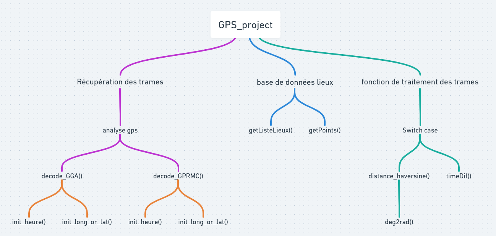
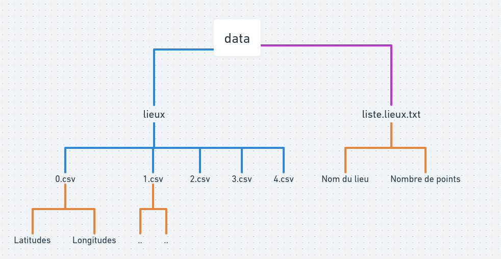
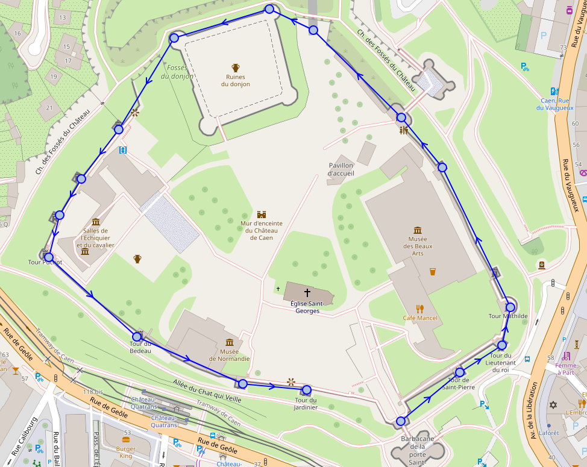
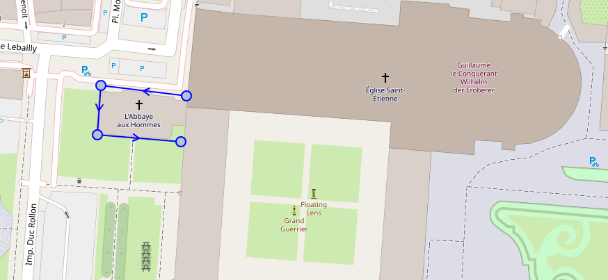
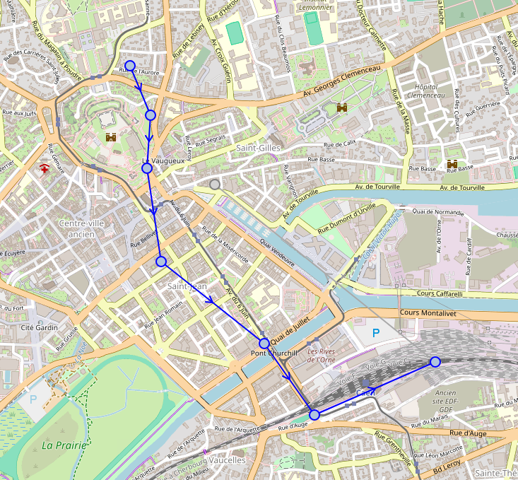
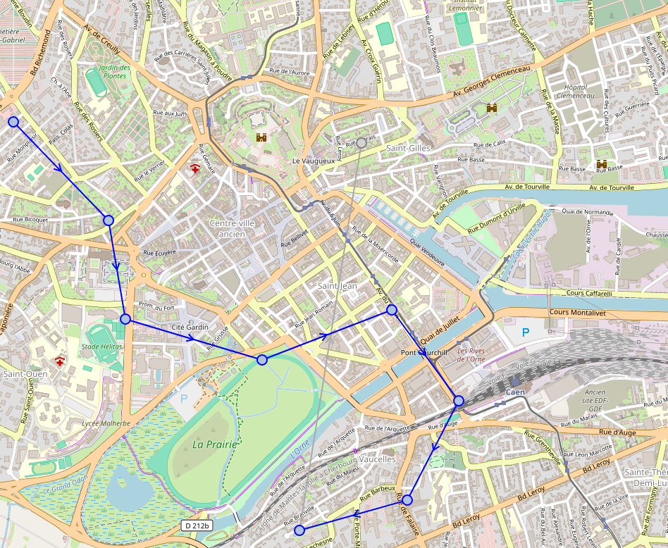

# GPS_project

## Architecture logiciel
- 


# Architecture base de donnée
- 

## Sommaire
 - [Utilisation appareil gps](#utilisation-appareil-gps)
 - [Simulation des points gps](#simulation-des-points-gps)
 - [Analyse des trames](#analyse-des-trames)

## Utilisation appareil gps

```bash
./setup.bash
```

## Simulation des points gps
Avoir des trames valide lors de leurs acquisition. 
 - setup nmeasimulator : https://github.com/panaaj/nmeasimulator/releases
 - https://help.ubuntu.com/kubuntu/desktopguide/fr/manual-install.html

Remarque : regarder le fichier output.nmea comme exemple
```bash
nmeasimulator
```

Faire cette commande pour lancer le programme et visualiser le chemin qu'a fait la personne.

Ensuite cliquer sur le logo en haut à droite ( follow track ) pour visualiser la trame sur la mini map. 
Avec le programme il est même possible de le faire en temps réel.

## Analyse des trames

```bash
make
./script_trajectoire arg[1] arg[2] arg[3]
```

### Le programme prend des arguments en ligne de commande pour effectuer différentes actions :
---
- `0` : Affiche les lieux enregistrés
---
- `1` : Calcul de la distance parcourue et la durée de cet itinéraire
  - `arg[2]` : Fichier d'itinéraire (itineraire.txt)
---
- `2` : Calcul la distance entre deux lieux
  - `arg[2]` : Premier lieu
  - `arg[3]` : Deuxième lieu
---
- `3` : Analyse l'itinéraire en proposant pour chaque point la distance qui le sépare du lieu
  - `arg[2]` : Fichier d'itinéraire (itineraire1.txt)
  - `arg[3]` : Lieu à comparer
---
- `4` : Les points de rencontre (100m) entre deux itinéraires
  - `arg[2]` : Premier itinéraire
  - `arg[3]` : Deuxième itinéraire
---

### The program takes command-line arguments to perform different actions:

---

- `0`: Displays registered locations
-  Chateau
-  
-  Abbaye aux Hommes
-  

---

- `1`: Calculates the distance traveled and the duration of this route
  - `arg[2]`: Route file (itineraire.txt)

---

- `2`: Calculates the distance between two locations
  - `arg[2]`: First location
  - `arg[3]`: Second location

---

- `3`: Analyzes the route by proposing for each point the distance separating it from the location
  - `arg[2]`: Route file (itineraire1.txt)
  - `arg[3]`: Location to compare

---

- `4`: Meeting points (100m) between two routes
  - `arg[2]`: First route
  - 
  
  - `arg[3]`: Second route
  - 
  

---


